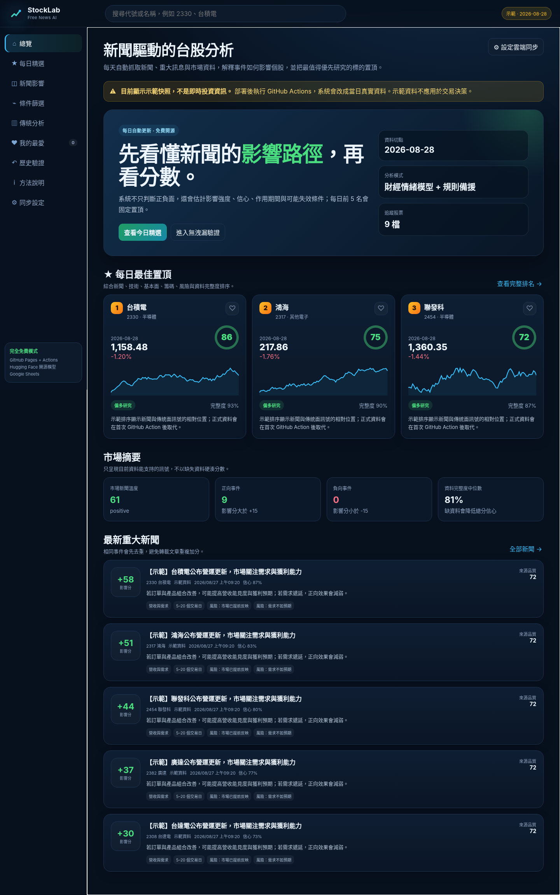
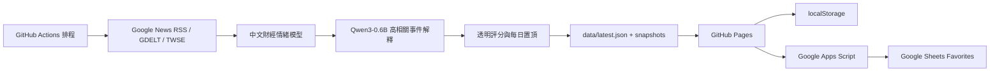

# StockLab Free AI v14

一套可直接部署到 **GitHub Pages** 的免費台股新聞研究工具。它每天由 **GitHub Actions** 抓取新聞與官方資料，使用 **Hugging Face 開源模型在 runner 本機推論**，再把靜態 JSON 交給前端顯示；不需要付費 LLM API，也不需要長時間運行的伺服器。

> 本工具是研究與驗證系統，不是投資建議。免費來源、小型模型與公開端點可能延遲、缺漏或改版。



## 這一版補齊的功能

### 每日新聞與 AI 影響分析

每一則新聞都輸出：

- 正向、負向或中性
- `-100～+100` 影響分
- 模型信心
- 1–5、5–20 或 1–20 個交易日的影響區間
- 事件類型、影響機制、失效條件與風險
- 公司關聯度、來源品質、發布時間與資料可用時間
- 使用的模型或規則版本

新聞會先做公司關聯判定與近似去重，再加權彙總，不會因同一事件被大量轉載而重複灌分。

### 每日最佳自動置頂

首頁每天自動選出最多五檔置頂股票。未通過全部門檻時寧可少顯示，不會為了湊滿名額硬推股票。入選條件不只看樂觀新聞，也會同時檢查：

- 最低綜合分
- 資料完整度
- 新聞平均關聯度
- 風險上限
- 技術、基本、籌碼與新聞是否大致一致

規則可在 `config/settings.json` 修改。

### 我的最愛

- 未設定雲端時：使用瀏覽器 `localStorage`，完全免費且可離線保留。
- 設定後：透過自己的 **Google Apps Script Web App** 同步到 **Google Sheets**。
- 支援加入、移除、備註、跨裝置同步、離線補同步與軟刪除。
- Apps Script 暫時失效時，本機最愛仍保留。

設定程式位於 `google-apps-script/`。

### 傳統分析補全

- 技術：SMA、EMA、RSI、MACD、KD、ATR、量比、支撐與壓力
- 基本：月營收、年增/月增、本益比、股價淨值比、殖利率
- 籌碼：外資、投信、自營商、三大法人合計
- 風險：波動、估值、嚴重負面事件、低品質來源與資料缺口
- 資料治理：每個主要欄位保留來源與可用時間

### 歷史回放與無未來洩漏

- 可指定任意切點建立 `data/snapshots/YYYY-MM-DD.json`。
- Snapshot 只保存當時可知的新聞、價格與預測。
- `actual_return`、命中與未來價格只可在使用者明確 `--reveal` 後寫入獨立的 `data/results/`。
- 回溯模式不會把今天的「最新基本面」倒填到過去；找不到 point-in-time 檔時，寧可顯示缺資料。
- `scripts/validate_no_leak.py` 會拒絕未來日期與答案欄位。

專案內已放入 `2025-08-15` 的合成無答案示範快照；它不包含該日之後的真實答案。

## 免費架構



| 元件 | 免費方案 | 付費金鑰是否必要 |
|---|---|---|
| 網站 | GitHub Pages | 否 |
| 每日更新 | GitHub Actions | 否 |
| 新聞 | Google News RSS、GDELT、TWSE 重訊 | 否 |
| 價格與傳統資料 | Yahoo chart fallback、TWSE OpenAPI/T86 | 否 |
| 全量情緒 | `bardsai/finance-sentiment-zh-fast` | 否 |
| 高相關事件整理 | `Qwen/Qwen3-0.6B` | 否 |
| 我的最愛 | localStorage + Google Sheets Apps Script | 否 |
| 大量歷史回填 | Kaggle Notebook（選用） | 否 |

模型權重不包含在 ZIP 中；第一次 GitHub Action 會由 Hugging Face 下載並快取。公開模型通常不需要 `HF_TOKEN`，遇到下載速率限制時才可選擇加入唯讀 token。

## 立即在本機查看

```bash
cd stocklab-free-ai-v14
python -m http.server 8000
```

瀏覽器開啟：

```text
http://localhost:8000
```

不要直接雙擊 `index.html`，因為瀏覽器通常會阻擋 `file://` 讀取 JSON。

目前附帶的 `latest.json` 是**清楚標示的合成示範資料**。首次執行每日 Action 後會被正式資料取代。

## 部署到 GitHub Pages

最簡步驟：

1. 把整個資料夾內容放到公開 GitHub Repository 根目錄。
2. Repository 的 **Settings → Pages → Build and deployment** 選擇 **GitHub Actions**。
3. 到 **Actions → Daily free news analysis → Run workflow** 執行第一次更新。
4. `pages.yml` 會部署根目錄，`daily-update.yml` 會在台北時間工作日傍晚更新資料；更新或歷史回填完成後，`pages.yml` 會接續部署最新資料。

完整操作與既有 `flyree140/stocklab` 的安全合併方式：

- [`docs/DEPLOY_GITHUB.md`](docs/DEPLOY_GITHUB.md)
- [`docs/MIGRATE_FROM_OLD_STOCKLAB.md`](docs/MIGRATE_FROM_OLD_STOCKLAB.md)

## Google Sheets 最愛同步

請依照：

- [`google-apps-script/SETUP.md`](google-apps-script/SETUP.md)
- [`docs/GOOGLE_SHEETS_FAVORITES.md`](docs/GOOGLE_SHEETS_FAVORITES.md)

這個方案適合個人、低敏感度書籤；不是完整會員系統。不要把 Google 帳號密碼當同步金鑰，也不要在公開畫面顯示金鑰。

## 執行每日分析

只使用透明規則與免費資料：

```bash
pip install -r requirements.txt
ENABLE_HF_SENTIMENT=0 ENABLE_QWEN=0 python scripts/update_daily.py
```

使用兩個 Hugging Face 模型：

```bash
pip install -r requirements.txt -r requirements-models.txt
ENABLE_HF_SENTIMENT=1 ENABLE_QWEN=1 python scripts/update_daily.py
```

若 Qwen 在 CPU 太慢，可保留財經情緒模型：

```bash
python scripts/update_daily.py --skip-qwen
```

## 歷史驗證

建立 2025-08-15 無答案快照：

```bash
python scripts/backtest.py --as-of 2025-08-15 --skip-qwen
```

驗證快照沒有偷看未來：

```bash
python scripts/validate_no_leak.py data/snapshots/2025-08-15.json
```

只有你明確決定揭曉時：

```bash
python scripts/backtest.py --as-of 2025-08-15 --reveal --skip-qwen
```

結果會寫到另一個檔案，不會污染原始 snapshot。

## 測試

```bash
pip install -r requirements.txt
python scripts/quality_check.py
pytest -q
```

交付版本的離線測試包含：技術指標、新聞分數、風險折扣、每日置頂條件與 no-leak 驗證。

## 目錄

```text
.
├── index.html                     # 靜態網站入口
├── assets/                        # UI、樣式、Logo、畫面
├── config/                        # 股票清單與評分設定
├── data/                          # latest、歷史 snapshots、顯式 results
├── scripts/                       # 抓取、模型、評分、回測與驗證
├── google-apps-script/            # Google Sheets 我的最愛後端
├── notebooks/                     # Kaggle 歷史回填選用 Notebook
├── tests/                         # 離線測試
├── docs/                          # 完整說明
└── .github/workflows/             # 每日更新、Pages、歷史回填與品質檢查
```

## 重要文件

- [架構與資料流](docs/ARCHITECTURE.md)
- [新聞與綜合評分](docs/SCORING.md)
- [免費模型策略](docs/FREE_MODELS.md)
- [無未來洩漏設計](docs/NO_LEAK_VALIDATION.md)
- [參考網站去蕪存菁](docs/COMPETITOR_REVIEW.md)
- [疑難排解](docs/TROUBLESHOOTING.md)

## 授權

本專案程式碼採 MIT License。新聞、行情與官方資料仍受各來源條款約束；Hugging Face 模型依各自 model card 授權。模型權重不隨本專案重新散布。
