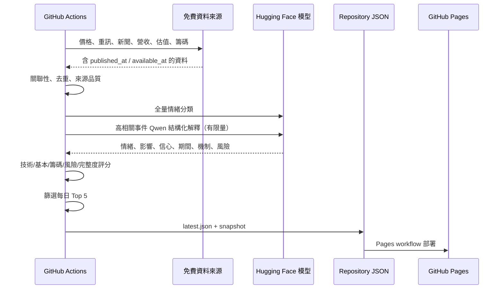
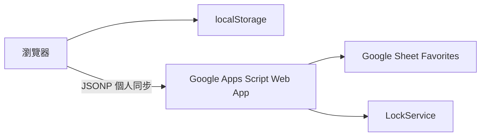

# 系統架構與資料流

## 設計目標

1. 完全可以在公開 GitHub Repository 免費運作。
2. 不把付費 LLM API 當必要條件。
3. 前端不保存模型金鑰。
4. 每日資料可重現、可追蹤、可回測。
5. 歷史 snapshot 與事後答案物理分離。
6. 任一免費來源或模型失效時，網站仍能降級運作。

## 每日流程

## 前端

前端只讀：

- `data/latest.json`
- `data/manifest.json`
- 使用者選擇歷史日期後才讀 `data/snapshots/...`
- 使用者輸入 `REVEAL` 後才嘗試讀 `data/results/...`

這種安排使網站沒有常駐 server，也不需要把任何模型密鑰送到瀏覽器。

## 最愛同步

本機保存永遠先完成；雲端同步是附加功能。雲端錯誤只顯示通知，不回滾本機操作。

## 失敗隔離

| 失敗點 | 行為 |
|---|---|
| Google News RSS | 使用 GDELT、重訊或空新聞集合 |
| GDELT | 保留 RSS、重訊 |
| 財經情緒模型 | 透明關鍵字規則 |
| Qwen | 分類器 + 規則機制描述 |
| 單檔價格 | 盡量保留前次資料並標記 stale |
| 全部價格失敗 | 不覆蓋現有 `latest.json` |
| Apps Script | 我的最愛留在 localStorage |
| 歷史基本面無 archive | 顯示缺資料，不使用今天資料倒填 |

## 主要資料來源

- TWSE OpenAPI：估值、月營收、重大訊息、指數
- TWSE T86：三大法人
- TWSE STOCK_DAY：上市股歷史價格 fallback
- Yahoo chart：一次抓取較長歷史價格的免費主來源
- Google News RSS：近期新聞
- GDELT DOC 2.1：近期與歷史新聞

免費端點可能改版，因此所有 adapter 集中在 `scripts/market_sources.py` 與 `scripts/news_sources.py`。
